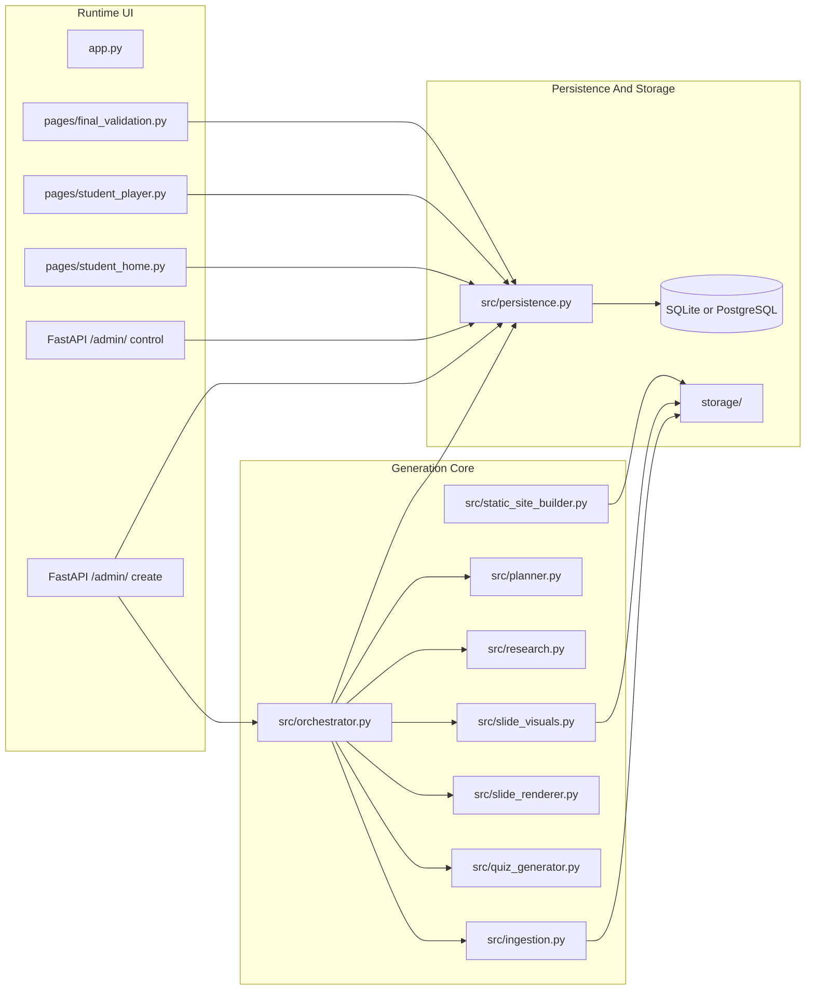
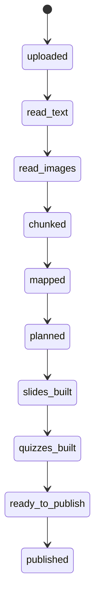
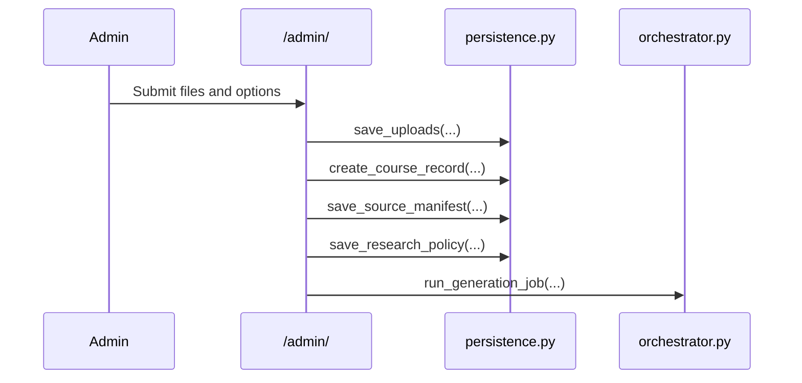
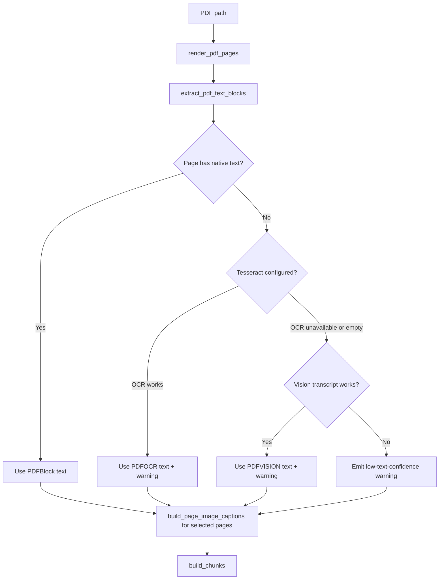
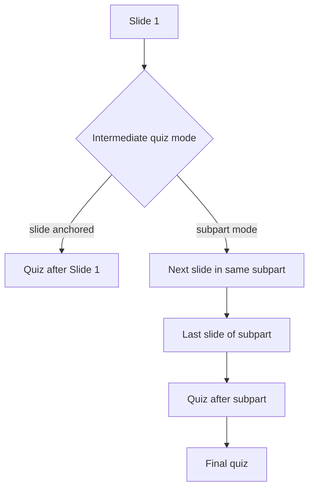
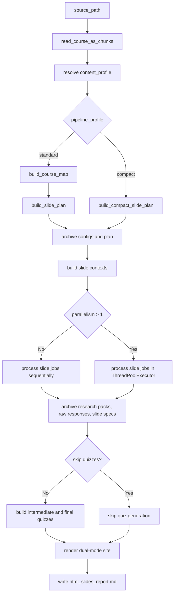

# Generate Lessons - Complete Pipeline Reference

This document is the code-backed system reference for the repository as it exists now.

It describes:

- the production Streamlit workflow
- the persisted orchestration model
- the manual HTML audit harness
- the ingestion, planning, research, slide, visual, quiz, and site-generation stages
- the storage model
- the current extension boundaries

For the opening-visual branch only, see `docs/image_generation_pipeline.md`.

## 1. Scope And Current Runtime Surfaces

The repository currently exposes three distinct runtime surfaces.

| Surface | Entry point | Uses persistence | Uses production orchestrator | Supports `PPTX` |
| --- | --- | --- | --- | --- |
| Streamlit application | `app.py` | Yes | Yes | No |
| HTML generation harness | `scripts/test_html_slides_generation.py` | No database writes | No, but mirrors most stages | No |
| Ad hoc multimodal ingestion harness | `scripts/adhoc_multimodal_ingestion.py` | No | No | Yes |

### 1.1 Why the distinction matters

- The FastAPI backend and admin site are the authoritative persisted workflow.
- The HTML harness is the most auditable path for slide-generation experiments because it archives each intermediate artifact to disk.
- The ad hoc ingestion harness is a separate exploratory branch for multimodal extraction, especially `PPTX`.

## 2. System Architecture



## 3. Orchestrator State Machine

The production workflow is implemented by `CourseOrchestrator` in `src/orchestrator.py`.



### 3.1 Current operational behavior

- `uploaded` is marked done as soon as the orchestrator starts with a registered course.
- `read_text`, `read_images`, and `chunked` are set during ingestion.
- `mapped`, `planned`, `slides_built`, and `quizzes_built` are resumable.
- `published` is written later by `publish_course(...)`, not by `run_generation_job(...)`.

### 3.2 Resumability contract

If a step is already marked `done`, the orchestrator reloads saved artifacts instead of recomputing them.

Current persisted reuse includes:

- chunks
- course map
- slide plan
- rendered slides
- quizzes

Single-slide regeneration is also supported through `trigger_regeneration(course_id, slide_id)`.

## 4. Domain Model

Core schema lives in `src/models.py`.

### 4.1 Document and planning models

| Model | Role | Key fields |
| --- | --- | --- |
| `DocumentChunk` | Normalized source-document chunk | `chunk_id`, `heading_path`, `page_start`, `page_end`, `text`, `image_refs`, `source_refs`, `confidence` |
| `ResearchPolicy` | Research controls | `guide`, `allowed_domains`, `language`, `external_web_access` |
| `CourseSubpart` | Course-map section | `subpart_id`, `title`, `objective`, `key_points`, `source_refs` |
| `CourseMap` | Planned course decomposition | `title`, `sections` |
| `SlidePlanItem` | One planned slide | `slide_id`, `subpart_id`, `title`, `objective`, `chunk_ids`, `course_points`, `research_brief` |
| `SlidePlan` | Ordered slide list | `items` |

### 4.2 Research and slide models

| Model | Role | Key fields |
| --- | --- | --- |
| `ResearchSource` | One normalized web source | `title`, `url`, `rationale` |
| `ResearchPack` | Slide-scoped web enrichment | `query`, `summary`, `sources` |
| `SlideBlock` | One content block | `kind`, `title`, `text`, `bullets`, `image_url`, `image_path`, `rows`, `latex` |
| `SlideSpec` | Final structured slide | `slide_id`, `subpart_id`, `layout`, `blocks`, `course_refs`, `web_refs`, `teacher_notes` |
| `RenderedSlide` | Slide plus HTML | `slide`, `html` |
| `SlideDeck` | Persisted ordered deck | `items` |

Current allowed `SlideBlock.kind` values:

- `hero`
- `bullets`
- `quote`
- `image`
- `table`
- `sources`
- `formula`

Current allowed `SlideSpec.layout` values:

- `title`
- `two_columns`
- `bullets`
- `quote`
- `table`
- `spotlight`
- `comparison`
- `magazine`
- `mosaic`
- `storyline`
- `triptych`
- `sidebar_focus`
- `dashboard`
- `staggered`

### 4.3 Quiz models

| Model | Role |
| --- | --- |
| `QuestionDraft` / `QuestionDraftSet` | Intermediate structured quiz drafts from the LLM |
| `OptionSpec` | Materialized answer option |
| `QuestionSpec` | Final question |
| `QuizSpec` | Intermediate or final quiz |
| `QuizCollection` | Persisted list wrapper |

## 5. Persistence Model

`src/persistence.py` defines the SQL tables and JSON artifact storage helpers.

### 5.1 SQL tables

| Table | Purpose | Notes |
| --- | --- | --- |
| `School` | School / tenant profile | IAAG is seeded by default; custom schools store name, logo source, logo file path and default flag |
| `Course` | Top-level course record | Linked to `School` through `school_id`; `source_path` stores only the first source file; full multi-file metadata lives in `source_manifest` |
| `CourseArtifact` | Generic JSON artifact storage | One row per `course_id` + `artifact_type` |
| `GenerationStepRecord` | Step-state ledger | Used for resumability and admin visibility |
| `Attempt` | Learner quiz state | Stores current index, answers, completion, score |

### 5.2 Artifact types currently written

- `source_manifest`
  - source document list
  - selected `school_id` / `school_name`
  - effective logo metadata copied from the selected school
- `research_policy`
- `chunks`
- `course_map`
- `slide_plan`
- `slides`
- `subpart_quizzes`
- `final_quiz`
- `alerts`
- `events`

### 5.3 Step and status fields

The `GenerationStep` schema allows:

- names:
  - `uploaded`
  - `read_text`
  - `read_images`
  - `chunked`
  - `mapped`
  - `planned`
  - `slides_built`
  - `quizzes_built`
  - `ready_to_publish`
  - `published`
- statuses:
  - `pending`
  - `running`
  - `done`
  - `failed`

## 6. Storage Layout

### 6.1 Production storage

```text
storage/
|-- uploads/<course_id>/
|   `-- original uploaded documents
`-- courses/<course_id>/
    |-- pdf/
    |-- pages/
    |-- media/
    `-- generated_visuals/
```

### 6.2 Harness storage

```text
storage/manual_slide_tests/<slug>/
|-- archived_steps/
|   |-- 00_run_config.json
|   |-- 01_ingestion_chunks.json
|   |-- 02_course_map.json
|   |-- 03_slide_plan.json
|   |-- 04_slide_contexts/<slide>.json
|   |-- 05_research_packs/<slide>.json
|   |-- 05_research_responses/<slide>.json
|   |-- 06_slide_specs/<slide>.json
|   `-- 07_quizzes/
|-- rendered_slides/
|   |-- index.html
|   |-- master/
|   `-- user/
|-- generated_quizzes/
|   |-- intermediate_quizzes.json
|   |-- subpart_quizzes.json
|   |-- final_quiz.json
|   `-- quiz_generation_report.md
`-- html_slides_report.md
```

### 6.3 Generated Markdown under `storage/`

Markdown files under `storage/` are generated run reports. They are artifacts of previous script executions, not maintained source documentation.

## 7. Upload And Course Registration

Admin upload is implemented in the FastAPI admin site served at `/admin/`.

### 7.1 Current UI inputs

- `1..5` uploaded `PDF` / `DOCX` files
- research guide
- preferred domains
- quiz difficulty (`easy` or `hard`)
- external web toggle
- content profile selection: `auto|standard|scientific`
- intermediate quiz mode and question count
- logo selection:
  - default IAAG logo when no override is supplied
  - optional uploaded logo file
  - optional logo URL when no file is supplied

### 7.2 Registration sequence



### 7.3 Important implementation detail

For multi-document uploads:

- the `Course` row stores a summarized display filename plus the first source path
- the full file list is preserved separately in `source_manifest`
- the selected logo metadata is preserved in `source_manifest`
- if no logo override is supplied, `src/static_site_builder.py` uses `assets/iaag-logo.png`
- generated images must not include the school name, IAAG, logos, institutional marks, or watermarks; the real logo is added later as a controlled site asset

## 8. Ingestion Algorithm

Production ingestion is implemented in:

- `src/ingestion.py`
- `src/chunk_reader.py`
- `src/doc_convert.py`
- `src/image_captioning.py`

### 8.1 Input validation

Current file validation rules:

- extensions limited to `.pdf` and `.docx`
- max file size `30 MB`
- max source document count `5`

### 8.2 Multi-source ingestion

`read_sources_as_chunks(...)`:

1. validates source list
2. creates a sub-working directory per source document
3. ingests each source independently
4. merges chunks
5. namespaces chunk IDs as `doc01-chunk-0001`, `doc02-chunk-0001`, ...
6. concatenates file hashes into a combined SHA-256 digest
7. preserves the first available `pdf_path`

### 8.3 PDF ingestion



Current behavior:

- pages are rasterized with `PyMuPDF`
- native text extraction uses `page.get_text("blocks")`
- OCR fallback depends on `TESSERACT_CMD`
- vision transcript fallback depends on `OPENAI_API_KEY`
- page-image captions are generated only for selected candidate pages

Current PDF alerts:

- `pdf-ocr-fallback`
- `pdf-vision-fallback`
- `pdf-low-text-confidence`

### 8.4 DOCX ingestion

Production DOCX ingestion currently does all of the following:

1. tries to convert the DOCX to PDF using the configured converter list
2. extracts paragraph text and heading hierarchy with `python-docx`
3. extracts embedded images from `word/media/*`
4. captions extracted embedded images when possible
5. if PDF conversion succeeded, rasterizes converted pages and captions selected pages
6. builds chunks using paragraph blocks plus extracted figures and optional converted page images

Current DOCX alerts include:

- converter-related alerts from `src/doc_convert.py`
- `docx-no-embedded-images`

### 8.5 Ad hoc `PPTX` ingestion

Only `scripts/adhoc_multimodal_ingestion.py` currently supports `PPTX`.

That branch:

- extracts slide text and notes with `python-pptx`
- extracts picture shapes
- captions extracted images
- can synthesize transcript blocks from image-only slides

It is useful for experimentation, but not part of the production course-generation path.

### 8.6 Chunk building rules

Chunking is character-budget based:

- `CHUNK_SOFT_TARGET_CHARS = 3500`
- `CHUNK_MAX_CHARS = 6000`
- `MAX_IMAGES_PER_CHUNK = 2`

Flush behavior:

- flush if appending the next block would exceed `CHUNK_MAX_CHARS`
- flush at the soft target if the next block is a heading-style block

Current chunk assembly behavior:

- chunk text is a newline-joined concatenation of block texts
- `page_start` / `page_end` reflect the buffered block span
- page images are attached for up to two pages
- DOCX figures are attached first-page-only in production
- chunk confidence drops to `0.6` if any buffered block comes from `PDFOCR` or `PDFVISION`

### 8.7 Ingestion confidence and alerts

The ingestion wrapper adds `low-confidence-chunks` if any chunk has confidence below `0.75`.

## 9. Planning

Planning lives in `src/planner.py`.

### 9.1 Standard profile

Standard profile is the production default:

1. `build_course_map(chunks)`
2. `build_slide_plan(course_map, chunks)`

Inputs to `build_slide_plan(...)` are intentionally reduced:

- the full `course_map`
- a summarized chunk list with excerpted text and capped image/source refs

### 9.2 Compact profile

Compact profile exists only in the HTML harness:

1. skip standalone course-map generation for slide planning
2. call `build_compact_slide_plan(chunks)`
3. if quizzes are still requested, build a course map afterward for quiz generation only

This reduces LLM round-trips and pairs with fast visual mode.

### 9.3 Slide context assembly

Before slide generation, `gather_slide_context(...)` builds a slide-scoped context containing:

- `slide_id`
- `subpart_id`
- `title`
- `objective`
- `course_points`
- `research_brief`
- deduplicated heading strings
- selected chunk payloads
- flattened image references
- deduplicated course references

## 10. Research Branch

Research logic lives in `src/research.py`.

### 10.1 Tool setup

The research tool passed to the model is:

- `type = web_search`
- `external_web_access = policy.external_web_access`
- optional `filters.allowed_domains = policy.allowed_domains`

### 10.2 Current model behavior

The model is responsible for deciding:

- which queries to issue
- how many searches to make
- which returned sources to keep

The Python layer is responsible for normalization and safety.

### 10.3 Source normalization rules

Current normalization behavior:

1. parse the structured pack returned by the model
2. recursively walk the raw response object
3. collect any object that looks like a `title + url` source
4. keep only valid absolute `http` / `https` URLs
5. discard internal pseudo-URLs such as `course:`, `file:`, `data:`, `about:`
6. deduplicate by normalized URL

### 10.4 Failure mode

If research fails, the system uses:

```text
summary = "Enrichissement web indisponible. Le slide repose uniquement sur le cours fourni."
sources = []
```

Generation continues with a warning instead of stopping.

### 10.5 Production vs harness research policy

- Production app: research policy comes from the admin upload form.
- HTML harness: the policy is currently `ResearchPolicy(external_web_access=True)` with no guide and no domain filtering.

## 11. Slide Generation

Slide generation is centered on `build_slide_spec(...)`.

### 11.1 Input contract

Inputs:

- one `SlidePlanItem`
- one slide context
- one `ResearchPack`
- optional `repair_note`

Output:

- one validated `SlideSpec`

### 11.2 Hard slide-generation guardrails

The prompt layer currently requires:

- dense, pedagogically useful content
- acronym expansion on first mention
- emphasis on mechanisms, usage conditions, limits, maintenance impact, and operational consequences
- informative bullet points
- optional injection of `1..3` web-derived precisions when available
- no raw source-document images in final slides
- optional `formula` blocks when a symbolic relation helps
- layout choice that supports the message

### 11.3 Source-image exclusion rule

This is one of the most important current behaviors.

The system uses source images for comprehension, but not as final teaching media.

Implementation details:

1. `_build_slide_generation_context(...)` sends `image_refs = []` to the model
2. the context also includes a `source_image_policy` string that forbids rendering imported page captures or extracted figures
3. `_strip_source_document_image_blocks(...)` removes any image block whose local path matches a known source image path

This means a model can still mistakenly emit a page screenshot path, but the post-processor strips it out.

### 11.4 Web reference merge rule

After slide generation:

- existing `slide.web_refs` are kept
- research-pack sources are merged into `slide.web_refs`
- deduplication is done by URL when available

### 11.5 Formula support

`formula` blocks must satisfy:

- `latex` is required
- raw HTML markup is forbidden inside `latex`

The renderer normalizes TeX accent sequences and emits MathJax display delimiters only when formulas exist.

## 12. Visual Summary Injection

The opening-image branch is implemented in `src/slide_visuals.py`.

High-level behavior:

1. build a `SlideVisualPlan`
2. generate or synthesize a visual asset
3. insert an `image` block titled `Synthese visuelle` at the front of the slide

Production orchestrator behavior:

- always uses the default `visual_mode="standard"`

HTML harness behavior:

- `standard` profile -> `visual_mode="standard"`
- `compact` profile -> `visual_mode="fast"`

For full details, see `docs/image_generation_pipeline.md`.

## 13. Validation And Repair

Validation lives in `src/validators.py`.

### 13.1 Slide validation

Current checks:

- slide must contain at least one block
- image blocks need `image_url` or `image_path`
- remote image URLs must be `http` / `https`
- formula blocks need non-empty LaTeX and must not contain `<` or `>`
- bullet blocks must contain at most `8` bullets
- table blocks must contain rows

### 13.2 Quiz validation

Current checks:

- quiz must contain exactly the expected number of questions
- each question must contain exactly `5` options
- `easy` questions require exactly `1` correct option
- `hard` questions require `2..4` correct options

### 13.3 Repair strategy

Production slide repair path:

1. attempt slide generation
2. inject opening visual
3. validate
4. if validation fails, regenerate with `repair_note`
5. inject visual again
6. validate again
7. if still invalid, append a blocking alert and stop

Quiz generation follows the same general idea: retry from structured draft generation if materialization or validation fails.

## 14. Quiz Generation

Quiz generation is implemented in `src/quiz_generator.py`.

### 14.1 Question materialization contract

The LLM first returns `QuestionDraftSet`, where each question contains five assertions marked true or false.

The Python layer then:

1. validates the assertion count
2. validates truth-count rules by difficulty
3. creates a deterministic answer-key plan with `src/quiz_keys.py`
4. maps true and false assertions into options `A..E`

### 14.2 Difficulty rules

Current difficulty behavior:

| Difficulty | Correct answers per question |
| --- | --- |
| `easy` | exactly `1` |
| `hard` | between `2` and `4` |

### 14.3 Quiz families

Production app:

- one intermediate quiz per slide
- one final quiz per course

HTML harness:

- intermediate quiz generation is aligned to slide mode
- final quiz remains course-wide

### 14.4 Question counts

Production defaults from `src/config.py`:

- intermediate quiz mode: `slide`
- intermediate quiz target: `5`
- final quiz bank target: `100`
- final quiz learner draw: `25`

Harness overrides:

- `--questions-per-intermediate-quiz` changes only the intermediate target

## 15. HTML Rendering

Rendering lives in:

- `src/slide_renderer.py`
- `templates/slide.html.j2`
- `templates/quiz.html.j2`

### 15.1 Slide rendering behavior

Current renderer behavior includes:

- local image assets are converted to data URIs
- formulas are rendered through MathJax when needed
- creative layout classes are supported
- `?embed=1` hides full-shell chrome when a page is loaded inside the deck iframe

### 15.2 Master vs user mode

Current differences verified by tests:

- `master` shows teacher notes
- `master` exposes stronger artifact-navigation affordances
- `user` hides teacher notes
- `user` still keeps course and web references visible, but with learner-facing labels

## 16. Dual-Mode Static Site Builder

Static site generation lives in `src/static_site_builder.py`.

### 16.1 Page ordering



### 16.2 Current behavior

`build_page_records(...)`:

- interleaves slide pages and quiz pages
- inserts slide-anchored quizzes immediately after their anchor slide
- otherwise inserts one subpart quiz after the last slide of that subpart
- always appends the final quiz last when present

`render_dual_mode_site(...)` writes:

- `rendered_slides/index.html` portal
- `rendered_slides/site_manifest.json`
- `rendered_slides/master/*`
- `rendered_slides/user/*`

`master` additionally writes page-level JSON payloads.

## 17. HTML Harness Algorithm

The manual slide-site harness in `scripts/test_html_slides_generation.py` is the most observable end-to-end path in the repo.

### 17.1 CLI surface

| Flag | Meaning |
| --- | --- |
| positional `source_path` | Input `PDF` or `DOCX` |
| `--working-dir` | Override output folder |
| `--max-slides` | Limit plan items used |
| `--use-web-research` | Turn on web enrichment |
| `--pipeline-profile standard|compact` | Select planning and visual strategy |
| `--content-profile auto|standard|scientific` | Resolve or force the content-generation branch |
| `--parallelism` | Number of slide jobs in flight |
| `--skip-quizzes` | Do not generate quiz artifacts |
| `--questions-per-intermediate-quiz` | Intermediate quiz size |
| `--site-only` | Rebuild static site from archived artifacts |
| `--model` | Override text model for this run |

### 17.2 Full run sequence



The new `content_profile` resolution happens before planning. It does not replace `pipeline_profile`; it decides whether the prompts and validation stay `standard` or switch to `scientific`.

### 17.3 What is parallelized

Per-slide jobs include:

- research
- slide-spec generation
- visual generation

The harness restores deterministic output order after parallel execution so archived filenames and final sites remain stable.

### 17.4 `site-only` mode

`--site-only`:

- reads archived config, plan, and saved slide specs
- reuses archived quizzes unless `--skip-quizzes` is also set
- rebuilds only the static site
- fails if no archived slide specs are present

## 18. UI Surfaces

### 18.1 `app.py`

- initializes the database
- requires login
- exposes page navigation based on resolved user role

### 18.2 Admin pages

FastAPI `/admin/` create view:

- upload and generation launch
- research policy capture
- difficulty selection
- content profile selection: `auto|standard|scientific`
- intermediate quiz mode and question-count selection
- default IAAG logo, uploaded logo override, or logo URL override

FastAPI `/admin/` control and preview views:

- course selector
- rendered slide preview
- step-status inspection
- alert inspection
- source, web-reference, slide, image, QCM, narration, audio, and assembly inspection
- single-slide regeneration
- narration regeneration
- full-course regeneration
- QCM quality cleanup
- publication
- GitHub Pages `docs/` export

Publication is blocked when the learner site is missing or invalid, or when the final QCM bank is too small for the configured learner draw.

For the scientific branch details, see `docs/scientific_content_profile.md`.

### 18.3 Student pages

`pages/student_home.py`:

- lists published courses only

`pages/student_player.py`:

- renders one slide at a time
- launches intermediate quizzes after their anchor slide, or at subpart boundaries for subpart-mode runs
- persists progress and answers through `Attempt`

`pages/final_validation.py`:

- renders the final course quiz

## 19. Authentication

Authentication is implemented in `src/auth.py`.

Supported modes:

- `dev`
- `oidc`
- `none`

Current role resolution:

- explicit admin emails from `ADMIN_EMAILS`
- or email-domain match against `ADMIN_EMAIL_DOMAINS`
- otherwise `student`

## 20. Model And Reasoning Configuration

Current defaults from `src/config.py`:

| Setting | Current default |
| --- | --- |
| text model | `gpt-5.4-mini` |
| narration script model | `gpt-5.5` |
| narration script fallback model | `gpt-5.4-mini` |
| narration TTS model | `gpt-realtime-2` |
| narration audio QA | `enabled`, transcription model `gpt-4o-mini-transcribe`, `1` retry |
| image model | `gpt-image-2` |
| image QA vision model | `gpt-5.4-mini` |
| default difficulty | `easy` |
| default research language | `fr` |
| default target slides | `30` |
| default intermediate quiz mode | `slide` |
| default questions per intermediate quiz | `5` |
| default parallelism | `8` |

Current reasoning effort mapping:

| Task key | Value |
| --- | --- |
| `chunk_read` | `medium` |
| `course_map` | `medium` |
| `slide_plan` | `medium` |
| `slide_research` | `low` |
| `slide_spec` | `medium` |
| `slide_visual` | `low` |
| `subpart_quiz` | `low` |
| `final_quiz` | `medium` |
| `repair` | `medium` |

## 21. Performance Characteristics

Current dominant costs are usually:

- per-slide research
- per-slide structured slide generation
- opening-visual generation

Best current latency levers in the harness:

- `--pipeline-profile compact`
- `--parallelism N`
- `--skip-quizzes` when quiz artifacts are not needed
- `--site-only` when only HTML rebuilding is needed

Production upload path:

- production orchestrator also honors stored `parallelism`
- new uploads default to `8`
- existing archived run configs keep their persisted value

## 22. Current Constraints And Known Boundaries

- Production uploads accept only `PDF` and `DOCX`.
- `PPTX` support is exploratory and exists only in the ad hoc ingestion harness.
- Production intermediate quizzes are generated for each slide.
- The production orchestrator always uses standard visual mode.
- The HTML harness currently uses a simplified research policy compared to the production upload form.
- Source-document images are deliberately excluded from final slide content even when ingestion extracted them successfully.

## 23. Command Cookbook

### 23.1 Launch the app

```powershell
streamlit run app.py
```

### 23.2 Ingestion-only report

```powershell
.\.python311\python.exe scripts\test_document_ingestion.py "Documents Examples\AERONEFS ATA 24.pdf"
```

### 23.3 Standard slide-site generation

```powershell
.\.python311\python.exe scripts\test_html_slides_generation.py "Documents Examples\AERONEFS ATA 24.pdf" --use-web-research
```

### 23.4 Compact and parallel slide-site generation

```powershell
.\.python311\python.exe scripts\test_html_slides_generation.py "Documents Examples\AERONEFS ATA 24.pdf" --use-web-research --pipeline-profile compact --parallelism 5
```

### 23.5 Slide-anchored quizzes

```powershell
.\.python311\python.exe scripts\test_html_slides_generation.py "Documents Examples\AERONEFS ATA 24.pdf" --questions-per-intermediate-quiz 5
```

### 23.6 Rebuild the dual-mode site only

```powershell
.\.python311\python.exe scripts\test_html_slides_generation.py "Documents Examples\AERONEFS ATA 24.pdf" --working-dir "storage\manual_slide_tests\aeronefs-ata-24" --site-only
```

### 23.7 Ad hoc `PPTX` ingestion

```powershell
.\.python311\python.exe scripts\adhoc_multimodal_ingestion.py "Documents Examples\sample.pptx"
```

## 24. Test Coverage Landmarks

The current automated tests explicitly cover:

- multi-source ingestion merging and chunk namespacing
- compact planning without course-map dependency
- stripping source-document image blocks from generated slides
- research URL filtering
- visual retry, best-effort, and fallback branches
- resumable orchestration
- MathJax formula rendering
- master/user static site isolation
- custom intermediate quiz sizes

## 25. Related Documents

- `README.md`
- `docs/image_generation_pipeline.md`
