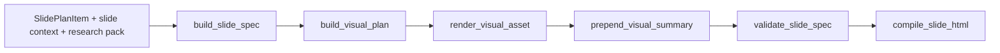
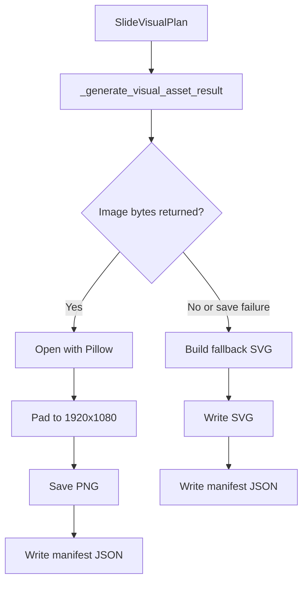

# Opening Visual Generation Pipeline

This document describes the current opening-visual branch implemented in `src/slide_visuals.py`.

The visual branch is responsible for inserting the leading `Synthese visuelle` image block on every final slide.

It does not reuse raw screenshots from the source document. It creates a new teaching-oriented visual summary from the slide content and its context.

## 1. Role In The Overall Pipeline



Important architectural rule:

- source-document images are used for comprehension upstream
- the visual branch is the sanctioned image path for final slides

## 2. Entry Points

Primary functions:

- `prepend_visual_summary(...)`
- `build_visual_plan(...)`
- `render_visual_asset(...)`

Supporting responsibilities inside the module:

- visual-plan normalization
- image prompt construction
- agentic retry loop
- single-shot mode
- cache management
- per-attempt artifact logging
- fallback SVG synthesis

## 3. Inputs And Outputs

### 3.1 Inputs

The branch consumes:

- `SlideSpec slide`
- `dict slide_context`
- `ResearchPack research_pack`
- `working_dir`
- optional `llm_client`
- `visual_mode` (`standard` or `fast`)

### 3.2 Output contract

The branch returns the same `SlideSpec`, modified so that:

- an `image` block titled `Synthese visuelle` is present first
- `block.text` contains `Format visuel : <visual_format>`
- `block.image_path` points to a generated `PNG` or fallback `SVG`

If an older `Synthese visuelle` image block already exists, it is replaced.

## 4. Visual Planning Stage

Planning is performed by `build_visual_plan(...)`.

### 4.1 Structured output model

The current `SlideVisualPlan` schema contains:

| Field | Meaning |
| --- | --- |
| `headline` | Short visual title in French |
| `visual_format` | Visual form label such as process diagram or concept map |
| `summary_points` | `3..6` compact points to show |
| `image_prompt` | Final image prompt in French |

### 4.2 Prompt intent

The planning prompt enforces:

- one visual for one slide only
- French output
- no invented facts or numbers
- educational infographic style
- light background
- premium educational infographic style
- useful density with supported facts, exact figures, and readable French text
- short labels plus enough explanatory content to teach the slide
- no photorealism
- no 3D
- no clutter

### 4.3 Planning payload

The planning call currently receives:

- serialized slide
- raw slide context
- serialized research pack
- a `slide_text_digest` derived from slide points and context

### 4.4 Fallback planning

If structured planning fails, `_build_fallback_plan(...)` constructs a plan locally from:

- slide title
- slide objective
- extracted slide points
- inferred visual format
- optional research summary

## 5. Plan Normalization

The plan is normalized before image generation.

Current normalization behavior:

- `headline` is truncated to eight words
- `visual_format` falls back to a heuristic if empty
- duplicate summary points are removed
- empty `summary_points` fall back to extracted slide points
- empty `image_prompt` is rebuilt locally

### 5.1 Visual-format heuristic

`_infer_visual_format(...)` infers the format from the slide title, objective, course points, and block types.

Examples of the current heuristic:

- process-related wording -> `Schema de processus`
- cycle-related wording -> `Cycle explicatif`
- chronology-related wording -> `Frise chronologique`
- comparison-related wording -> `Comparatif pedagogique`
- table-heavy slides -> `Tableau comparatif`
- fallback -> `Carte conceptuelle`

## 6. Prompt Construction

If the plan does not already contain a usable prompt, `_build_image_prompt(...)` builds one.

Current generated prompt characteristics:

- asks for a `16:9` educational infographic in French
- embeds the slide title and visual format
- uses a light, readable, premium infographic direction
- asks for a richer course image than a sparse poster or bare checklist
- instructs short French labels and supported facts
- requests sober `bleu/vert/orange` colors
- explicitly forbids photorealism and 3D

## 7. Standard vs Fast Modes

The module supports two runtime modes.

| Mode | Current behavior | Typical caller |
| --- | --- | --- |
| `standard` | Standard-quality branch, may use agentic retry loop | Production orchestrator and standard harness profile |
| `fast` | Single-shot image generation | Compact HTML harness profile |

### 7.1 How mode is selected today

- `CourseOrchestrator` calls `prepend_visual_summary(...)` with the default `visual_mode="standard"`
- `scripts/test_html_slides_generation.py` uses:
  - `standard` profile -> `visual_mode="standard"`
  - `compact` profile -> `visual_mode="fast"`
- independently of `visual_mode`, the visual planner now also receives the resolved `content_profile`
  - `standard` content profile -> default educational infographic rules
  - `scientific` content profile -> extra rules to preserve formulas, notation, theorem statements, and algorithm structure

## 8. Asset Generation Flow



### 8.1 Save-time behavior

When image bytes exist:

- the code opens them with `Pillow`
- pads the result to `1920x1080`
- saves `<slug>-visual.png`

If saving fails:

- the module logs a warning
- falls back to deterministic SVG
- records the save error in the manifest

## 9. Standard Mode: Agentic Retry Loop

When all of the following are true:

- `visual_mode != "fast"`
- `OPENAI_IMAGE_AGENTIC_ENABLED = true`
- `OPENAI_API_KEY` is present

the branch uses `_render_visual_with_agentic_retries(...)`.

### 9.1 Generation parameters

Each attempt currently calls:

- `client.images.generate(...)`
- `model = OPENAI_IMAGE_MODEL`
- `size = 1536x1024`
- `quality = high`
- `background = opaque`
- `output_format = png`

### 9.2 QA pass

After image generation, the PNG is critiqued by a vision model using `client.responses.create(...)` with:

- model `OPENAI_IMAGE_VISION_MODEL`
- reasoning effort `low`
- strict JSON schema output
- the generated PNG embedded as a base64 data URL

### 9.3 Acceptance rule

An attempt is accepted only if:

- PNG bytes exist
- critique returns `pass = true`
- `score >= OPENAI_IMAGE_MIN_ACCEPT_SCORE`

### 9.4 Best-effort rule

If no attempt reaches acceptance but at least one image exists, the module may still return the highest-scoring image when:

- `OPENAI_IMAGE_ALLOW_BEST_EFFORT = true`

### 9.5 Attempt cap

The code clamps attempts to at most `3`, even if a higher value is configured.

## 10. QA Taxonomy

The current issue taxonomy includes:

- `text_rendering`
- `accent_error`
- `apostrophe_error`
- `punctuation_error`
- `gibberish_text`
- `unexpected_text`
- `layout_clutter`
- `low_legibility`
- `wrong_hierarchy`
- `wrong_theme`
- `bad_spacing`
- `cropping`
- `generation_failed`
- `invalid_qa_payload`

The QA prompt explicitly prioritizes:

- French text quality
- accents
- apostrophes
- punctuation
- spacing
- legibility
- absence of gibberish

## 11. Critique-Driven Reprompting

If an attempt fails QA, the next prompt is built by `build_reprompt_from_critique(...)`.

The reprompt preserves or injects:

- the previous prompt
- correction round number
- goal to preserve
- approved elements to keep
- must-fix items
- prompt adjustments
- issue list to eliminate
- exact text reminders

### 11.1 Verbatim text block

The agentic branch can generate a `TEXT PRIORITY` block that:

- enumerates critical text snippets
- tells the model to prefer omission over incorrect rendering
- requires exact French accents and punctuation when text is shown

## 12. Fast Mode

When `visual_mode = "fast"`, the code uses `_render_visual_single_shot(...)`.

Current behavior:

- one `images.generate(...)` call
- no multi-round QA loop
- cache still applies
- artifact logging can still write the generated image
- returns `accepted_by = single_shot` on success

This is the mode used by the compact HTML harness profile.

## 13. Cache

The visual branch caches accepted PNGs under:

```text
generated_visuals/.cache/visual_<hash>.png
```

### 13.1 Standard-mode cache key

The agentic cache key includes:

- prompt
- goal spec
- image model
- vision model
- max attempts
- minimum accept score
- QA checks
- verbatim text blocks
- slide identifiers
- serialized plan

### 13.2 Fast-mode cache key

The single-shot cache key includes:

- image model
- final prompt
- slide-specific key parts

### 13.3 Cache semantics

- cache hits return immediately
- cached responses are marked `accepted_by = cache`
- cache is keyed strongly enough that prompt or model changes invalidate reuse

## 14. Artifact Logging

When `OPENAI_IMAGE_LOG_ATTEMPTS = true`, the branch writes per-slide artifacts under:

```text
generated_visuals/artifacts/<slide-slug>/
|-- image_attempt_1.png
|-- image_attempt_2.png
|-- image_attempt_3.png
|-- image_attempts.json
`-- final_image_qa.json
```

This is especially useful when:

- French labels are malformed
- best-effort acceptance is happening too often
- prompts need tuning

## 15. Fallback SVG

If image generation fails entirely, or if generated bytes cannot be saved as a PNG, the module builds a deterministic SVG via `_build_fallback_svg(...)`.

### 15.1 SVG characteristics

Current fallback SVG behavior:

- fixed `1920x1080` canvas
- light gradient background
- headline, objective, format badge, and up to six summary cards
- no dependency on external image services

This guarantees that every slide can still receive an opening visual block.

## 16. Output Files

For each slide, the visual branch writes:

```text
generated_visuals/
|-- <slide-slug>-visual.png
|-- <slide-slug>-visual.svg
|-- <slide-slug>-visual.json
|-- .cache/
`-- artifacts/
```

Only one of `.png` or `.svg` is used as the final asset for a given run.

### 16.1 Manifest contents

The manifest JSON currently stores:

- `slide_id`
- `subpart_id`
- `title`
- `objective`
- normalized `visual_plan`
- render result:
  - `final_prompt`
  - `attempt_count`
  - `status`
  - `accepted_by`
  - `from_cache`
  - `attempts`
- `final_asset_path`
- `fallback_used`
- `save_error`

Current `accepted_by` values include:

- `qa_pass`
- `best_effort`
- `cache`
- `single_shot`
- `none`

## 17. Integration With Slide Rendering

The visual block is inserted as the first `image` block of the slide.

During HTML rendering:

- local `image_path` assets are converted to data URIs
- the resulting slide HTML is self-contained and portable

This is why rendered slide files can be opened directly from disk or embedded inside the generated deck pages.

## 18. Relationship To Source-Document Images

This branch is intentionally separate from ingestion image extraction.

Current rules:

- source page captures and extracted figures may appear in chunk metadata
- they may inform comprehension upstream
- they are not supposed to appear in the final slide body
- the visual branch is the intended final-image mechanism

This separation is enforced both by prompting and by post-processing in `src/planner.py`.

## 19. Configuration Reference

| Variable | Default | Effect |
| --- | --- | --- |
| `OPENAI_IMAGE_MODEL` | `gpt-image-2` | Image generation model |
| `OPENAI_IMAGE_AGENTIC_ENABLED` | `true` | Enables multi-attempt QA loop in standard mode |
| `OPENAI_IMAGE_VISION_MODEL` | `gpt-5.4-mini` | Critique model |
| `OPENAI_IMAGE_MAX_ATTEMPTS` | `3` | Upper bound for retry loop |
| `OPENAI_IMAGE_MIN_ACCEPT_SCORE` | `85` | Minimum QA score for acceptance |
| `OPENAI_IMAGE_ALLOW_BEST_EFFORT` | `true` | Allows best available image even without full pass |
| `OPENAI_IMAGE_LOG_ATTEMPTS` | `false` | Writes per-attempt artifacts |

## 20. Operational Guidance

### 20.1 Use standard mode when

- typography quality matters
- the slide has many labels
- the visual is likely to need readable French text
- you want QA-backed acceptance or best-effort fallback

### 20.2 Use fast mode when

- you want faster iteration
- you are running the compact HTML harness
- you can tolerate lower confidence in label quality

### 20.3 Inspect these files when debugging

- `generated_visuals/<slug>-visual.json`
- `generated_visuals/artifacts/<slug>/image_attempts.json`
- `generated_visuals/artifacts/<slug>/final_image_qa.json`
- `generated_visuals/.cache/`

## 21. Related Code And Tests

Main code files:

- `src/slide_visuals.py`
- `src/slide_renderer.py`
- `src/planner.py`

Current test coverage includes:

- first-pass QA acceptance
- second-attempt reprompt success
- best-effort acceptance after repeated QA failures
- SVG fallback and manifest writing on failure
- fast-mode dispatch to single-shot rendering
